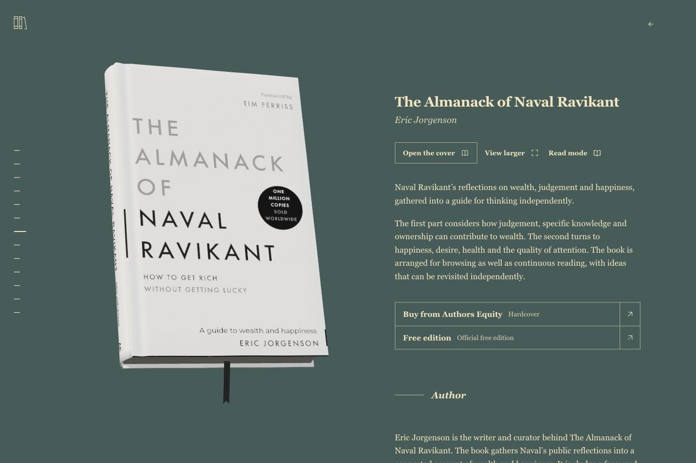

# Living Library

A tactile, scrollable library of real 3D books, inspired by [Stripe Press](https://press.stripe.com/). Pick a book from the stack, rotate it, open its cover, and turn its pages. The same book stays on screen throughout the interaction.



The complete Next.js app, **13 ready-to-use books**, optimized web assets, **13 editable Blender files with packed textures**, and instructions and tools for an AI agent to research and build another edition.

**You do not need Blender, an AI account, API keys or a database to run the library.** Blender and MCP are optional authoring tools.

## Run locally

Install Node.js 22 or 24, then:

```sh
git clone https://github.com/migueltorrezd/living-library.git
cd living-library
npm ci
npm run dev
```

Open [localhost:3000](http://localhost:3000). The clone includes editable assets, so it is larger than a typical web starter. Git LFS is not required.

For production:

```sh
npm run verify:assets
npm run build
npm start
```

The 3D view needs WebGL. Reading progress stays in the browser. External reading sources need internet access; bundled models and cover textures are served locally.

## Give it to your AI agent

Open this repository in your coding agent and use:

> Read AGENTS.md and docs/authoring/agent-workflow.md. Get the library running locally. Then help me add this specific book edition: [publisher link, ISBN or cover reference]. Set up Blender and Blender MCP if needed, research the matching front, spine, back and physical dimensions, build in a separate working copy, and verify the result in the actual library. Preserve existing books. Identify missing references instead of inventing an edition or claiming a reconstructed side is original artwork.

[Blender/MCP setup](docs/authoring/blender-setup.md) covers macOS, Windows, Linux, a pinned MCP version, Codex and JSON client configuration, and a live connection check. The [authoring workflow](docs/authoring/agent-workflow.md) covers research, materials, UVs, export, registration and visual review. A repository skill lives at [.agents/skills/library-books/SKILL.md](.agents/skills/library-books/SKILL.md).

```sh
npm run doctor
npm run research:book -- --isbn 9780141395869 --out .tmp/my-book/research.json
```

These inspect the environment and fetch an ISBN research record. They do not install software, purchase assets or change the catalogue.

## Included collection

Meditations · Thus Spoke Zarathustra · The Art of War · On the Origin of Species · The Wealth of Nations · The Republic · The Almanack of Naval Ravikant · The Book of Elon · How to Fail at Almost Everything and Still Win Big · Walden · Le Petit Prince · Cien años de soledad · Principia.

[COLLECTION.json](COLLECTION.json) records editions, measurements, references and reconstruction notes. The stack runs from the smallest cover footprint to the largest.

## Make it yours

| Change | File |
| --- | --- |
| Name, loading theme, footer, return link | `src/lib/library-settings.json` |
| Books and shelf order | `src/lib/books.ts` |
| Descriptions, biographies and optional praise | `src/lib/book-editorial.ts` |
| Background and UI colours | `src/lib/book-palettes.ts` |
| Publisher, author and purchasing links | `src/lib/book-buy-links.ts` |
| Model dimensions and versioned assets | `src/lib/model-manifest.json` |
| Optional full-text reading editions | `src/lib/reading.ts` |

## Guides

- [Install Blender and connect an agent](docs/authoring/blender-setup.md)
- [Research and build another book](docs/authoring/agent-workflow.md)
- [Export and install web models](docs/authoring/export-and-register.md)
- [Architecture](docs/standalone/architecture.md), [lighting/materials](docs/standalone/lighting-and-materials.md), [page/ribbon physics](docs/standalone/physics-and-reading.md)
- [Performance](docs/standalone/performance.md), [deployment](docs/standalone/deployment.md), [troubleshooting](docs/standalone/runbook.md)
- [Verification](docs/verification.md), [contributing](CONTRIBUTING.md), [asset notices](docs/standalone/asset-notices.md)

## Rights and provenance

Original application code and authoring scripts are [MIT licensed](LICENSE). **That license does not cover publisher artwork, book text, photographs, logos or bundled Blender/model assets containing those materials.** Their sources and limitations are recorded in the collection and asset notices. Models are visual reconstructions, with some estimated dimensions and reconstructed sides; they are not publisher-endorsed digital editions. Keep these distinctions when publishing a modified collection.
